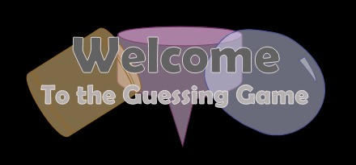

# The Word Guessing Game 

# Description 
On opening the game, you will be greeted with an egg to hatch - which once clicked will animate. You will then be prompted to pick a word guessing room. Once selected you will enter the Word Guessing game for that room, where you will guess words based on clues. Once the correct word is guessed the item will appear in the room. There are five questions in each room once finished you will have the option to go to another guessing room. One of the rooms is a classroom to test you on your JavaScript knowledge.\
I placed the svgs for the rooms and egg in the html so I could use the ids to animate the items. This also allowed me to hide items before they were guessed.

# Motivation
A fun project to help me learn JavaScript and CSS animations which also allowed me to have some fun illustrating.

# Reflection
On first review of this game with Gillian - she found the clues hard to understand - so I added in the number of expected letters for the words in the clue to make it more straight forward.\
I then got my mom to play the game and she got all the words no problem. Though she played it on her phone and found if she used the autofill feature the answers would be wrong, even when they were correct. So, I disabled autofill on the inputs.\
When I add the classroom, I got my brother to review the JavaScript questions and he approved the questions as understandable and answered them!\
This project allowed to me to have some more fun with JavaScript!

# Built With
- HTML
- CSS
- JavaScript.

# Link to Demo Site
https://isabelmcilroy.github.io/GuessingGame/

# Screenshot

